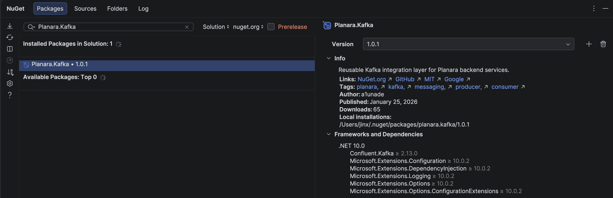

[](https://www.nuget.org/packages/Planara.Kafka)
[](LICENSE)

## Planara.Kafka

Пакет для интеграции с **Apache Kafka** в микросервисы с поддержкой продюсера, консьюмера, сериализации и автоматического создания топиков.

### Установка

```
dotnet add package Planara.Kafka
```

либо через **NuGet-Package Manager** в IDE:



> Пример для IDE *JetBrains Rider*

### Конфигурация

Для работы библиотеки необходимо добавить секцию **Kafka** в `appsettings.json`. Пример такой конфигурации:

```json
"Kafka": {
  "BootstrapServers": "localhost:9092",
  "ProducerTopics": {
    "Outbox": "outbox-topic"
  },
  "ConsumerTopics": {
    "Outbox": "outbox-topic"
  }
}
```

### Регистрация

Для регистрации у библиотеки есть несколько Extension-методов, можно подключить Consumer, Producer и TopicInitializer.

#### Consumer

Для регистрации Consumer'а (потребителя сообщений из Kafka) необходимо вызвать следующий метод:

```csharp
services.AddKafkaConsumer<TMessage>(configuration);
```

> где `TMessage` - тип получаемого сообщения, **configuration** - `IConfiguration`.

> ВАЖНО: для регистрации обязательно нужно указать **"ConsumerTopics"** в секции **"Kafka"** в файле `appsettings.json`, иначе Consumer вернет исключение `KafkaConsumerException`.

#### Producer

Для регистрации Producer'а (отправителя сообщений в Kafka)необходимо вызвать следующий метод:

```
services.AddKafkaProducer<TMessage>(configuration);
```

> где `TMessage` - тип отправляемого сообщения, **configuration** - `IConfiguration`.

> ВАЖНО: для регистрации обязательно нужно указать **"ProducerTopics"** в секции **"Kafka"** в файле `appsettings.json`, иначе Producer вернет исключение `KafkaProducerException`.

#### TopicInitializer

Для регистрации TopicInitializer (сервис, который отвечает за инициализацию топиков) необходимо вызвать следующий метод:

```csharp
services.AddKafkaTopicsInitializer(configuration);
```

> где **configuration** - `IConfiguration`.

> Инициализирует топики из каждой категории, поэтому важно, чтобы была секция **"ProducerTopics"** либо **"ConsumerTopics"** для **"Kafka"** в файле `appsettings.json`.